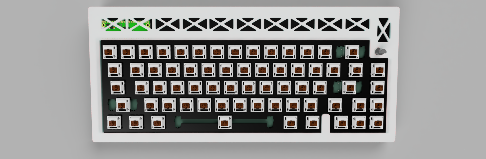
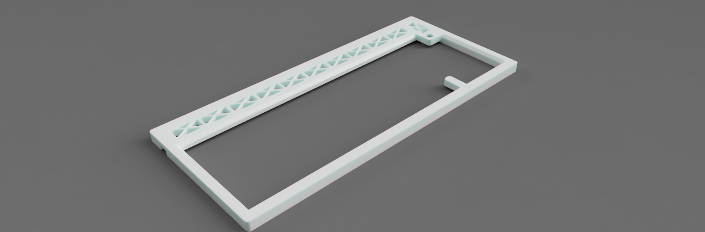
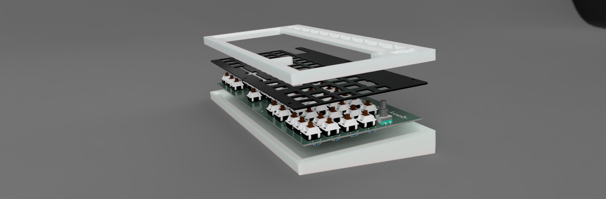
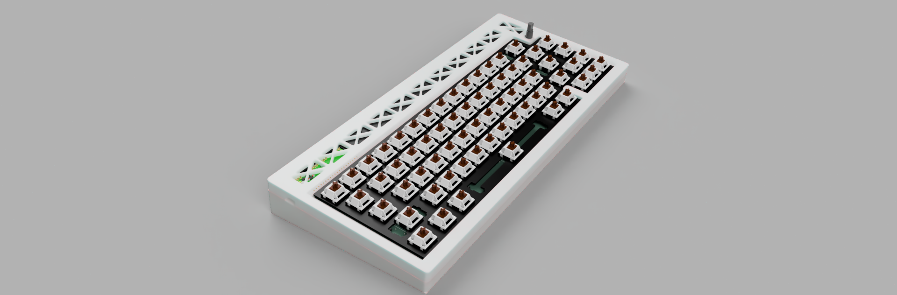
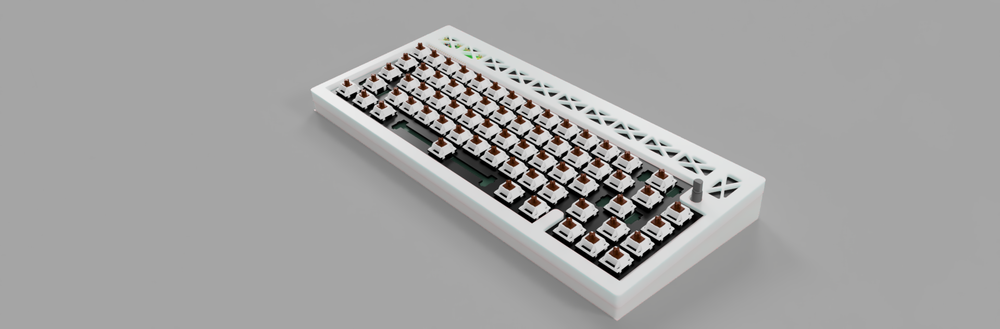

# keyboard - v2

- compact & sleek
- 66x keys!
- Tweaked 65% layout
- 1x EC11 Rotary Encoder - For Volume, Brightness, etc
- powered by rp pico
- KMK firmware
- WOBBLY WIGGLY silkscreen

## Description

This is my first project of this scale and it was an amazing experience building this, i got to learn a lot! 

I would like to thank hackclub's hackapad tutorial, Joe Scotto and Google, you guys were my saviors.

The keyboard is a tweaked default 65% layout with one key replaced by a RE. The MCU used is Raspberry Pi Pico and the firmware used is kmk.

layout:

<image src="assets_journal/layout.png" width="400">

## PCB

**Dimensions**: 307mm x 125mm
Made inside of Kicad

| Schematic                 |
| ------------------------- |
|  |

| Pcb                 |
| --------------------- |
|  |

| Assembled - front             |
| ------------------------ |
|  |

| Assembled - Back               |
| ----------------------- |
|  |

## Case

The case was made in Fusion360.

bottom:

plate:

top:

## Assembly:

## Port: 

## BOM

| Name                                                                  | Qty | Final Price - INR (USD) | Link                                                                                                                |
| --------------------------------------------------------------------- | --- | ----------------------- | ------------------------------------------------------------------------------------------------------------------- |
| Gateron EF Grayish                                                    | 80  | 1560 ($17.79)           | [here](https://neomacro.in/products/gateron-ef-grayish)                                                             |
| Cherry Profile PBT Keycaps                                            | 1   | 1299 ($14.81)           | [here](https://stackskb.com/store/veekos-gradient-keycaps-cherry-profile-135-keys/)                                 |
| Durock Smokey Screw-In Stabilizers V2 (4+1 w/ 6.25u spacebar)         | 1   | 1595 ($18.18)           | [here](https://stackskb.com/store/durock-smokey-screw-in-stabilizers-v2/)                                           |
| Diode 1N4148 Through - Hole                                           | 80  | 176 ($2.01)             | [here](https://roboticsdna.in/product/diode-1n4148/)                                                                |
| EC11 Rotary Encoder                                                   | 2   | 178 ($2.03)             | [here](https://amzn.in/d/hVRxzij)                                                                                   |
| M3 x 16mm Allen Bolt                                                  | 25  | 170 ($1.94)             | [here](https://www.amazon.in/RT-SENSE-Socket-Screws-Machine/dp/B0CX999P9J?crid=2LR651EVK17U6&dib=eyJ2IjoiMSJ9.pNwgmpLhpW7wMwHM-KbUxGVZIEWQ2PGyzOzppZaKMsH_eIl0XoWwObHuOTBQY-qZBu8ZQUnJfckAdPsG8raXK7qR8XB8MCC0i2wtfO1oT-nOePOt5mxRUj8Ucb9E33RXC6qDRZnypdXQTVkdquX1Q0ZcLuifCMFaAYO2HtIUq_JIllvDGxRuvqQ3c-rZqzXCEkMEDP47IOF2iwhRIUPUw57NAhduxtgZALv13CXXj4YBPeHcs29PGndT0i9IRJUeifo_HE2IIZ4FttYTmnpoowtiYnSRvn9NrZaGp0pjE2g.847NW6XZvS4t8iLKZyZfb2ihLqAsqOKPYnZJtFc3xyY&dib_tag=se&keywords=16mm%2Bscrew%2Ballen%2Bsocket%2Bm3&qid=1753889826&s=industrial&sprefix=16%2Bmm%2Bscrew%2Ballen%2Bsocket%2Bm3%2Cindustrial%2C256&sr=1-3&th=1)                                                                                   |
| M3 x 8mm Allen Bolt                                                   | 15  | 150 ($1.71)             | [here](https://www.amazon.in/RT-SENSE-Socket-Screws-Machine/dp/B0CX99XY91?crid=2AAVLRC2YKK5N&dib=eyJ2IjoiMSJ9.HGL6-0P5xO7QNC1ET0QVTqcjke85LzZ_hZFkE2FxStoyveDWcFTfmB0PbzocM9bLWFFNLuquRZevBamMDVv6f7dpj7wOrbBJBK2zKs-6mCrW48gMHICHbG_rYhk9p8f5-AuC5J7DMCQ-VZLxf9VF3ClZtXbCIfD-SNrdKhb3ctDg0MupFs3SLgcjo4KVJgbxcUZAjDfx_lG9zSqqlKLNb2Yo6DbtxAxZHNhLK5SwI8_hxLkeFY3v3M7xlaZVwBZkrNpkir422zl5ziZhtALxuxa8Tbmn16RyfBFr6-S-5LQ.WTUDRTVHWxEiKPkCARjbkRHYKSXbn3eUCPpKHZpgQZ8&dib_tag=se&keywords=8mm%2Bscrew%2Ballen%2Bsocket%2Bm3&qid=1753889576&s=industrial&sprefix=8mm%2Bscrew%2Ballen%2Bsocket%2Bm%2Cindustrial%2C245&sr=1-5&th=1)                                                                                   |
| M3 x 6mm Heatset Insert                                               | 12  | 100 ($1.14)             | [here](https://www.amazon.in/M3X6-Brass-Threaded-Round-Insert/dp/B0BB86CQSJ?crid=YYANQYUOPD4W&dib=eyJ2IjoiMSJ9.MemffQEv6bwN_JwUkjgflx4yIYhqm-RoBde59N0L6lAgMFwLuFXhTXzs0eDDDvillLCmvl9utxXvY49WkAfGcItHt6VeuPsJ9drtoxcmQGmNNcx1gavKHQunp5kw-RVbB5WgNUFQevQtkmyaHbSWSzZThYkrD4e64ZsYjEgj-ymPEzco9HdNRo16uPFU9F_OxiM3ed33wdClqKYUYyssQtOqYRFBF7eAdcrUMvf5zj9zd2SifrZUKiiOJZKEtIcVPqFy1BMa-mAQNq5PcKpe-ZDoQjop59g2b8F_UQIG7RM.hOB7rRGhO36946nYdxL4EXpyM_xdgFSJlnxi1Mm52lM&dib_tag=se&keywords=m3+4mm+heatset+inserts&qid=1753889984&s=industrial&sprefix=m3+4mm+heatset+inserts%2Cindustrial%2C212&sr=1-2)                                                                                   |
| Raspberry Pi Pico                                                     | 1   | 384 ($4.38)          | [here](https://roboticsdna.in/product/raspberry-pi-pico/)                                                           |
| Micro usb to type A cable                                                 | 2   | 580 ($6.62) | [here](https://www.amazon.in/amazon-basics-Braided-Charging-Transfer/dp/B0CH14KT9N?crid=7ZGZL0SGL62I&dib=eyJ2IjoiMSJ9.54pQ4hLP-x3QnLhOqkaGTy7rI5nnFnLYF-313TPM28L18X6r5ZCKEbeYkPNGO9xsBzB6A0knLau59HoH5s8y2_oozITo2lsVxj1CJAevJEhkgUtv_yfu0JsiZI1iWCJ_qfU07G3d2w5jV-JRmyCr0ZvmLtZVdnDna6yZQvqUs-UeQhuhdCSRuxgoQx3Ouvc-hEGrl-8z2HmKTjhQsAG4FZivKGkkLwcdb7KxPxWw66I.1HTltbJMC5n1amEKrnUqS-67AznIHpVUr3XIcqJ_iXE&dib_tag=se&keywords=micro%2Busb%2Bto%2Ba&qid=1753927324&sprefix=micro%2Busb%2Bto%2Ba%2Caps%2C279&sr=8-3&th=1)            |
| 4 in 1 USB hub                                                           | 1   | 200 ($2.28)         | [here](https://www.amazon.in/Amazon-Multiport-Adapter-Aluminium-MacBook/dp/B0CFLT45KH?crid=1AVZO6HJY7GKW&dib=eyJ2IjoiMSJ9.SbvLUcslbfZTFiES8rrCw2Nwiq7-hwNIM1JJEtVWqKmVIHD0xINbChtPw96BH1Z7bwAQvg7WEo0FLIj5NjPNZV3HESwG84oN9MGwFF_ktYWZFGq2_zIgHYh0_s8JsbwBZUuOctIL-YbY-ORDviNg51orED6FDcbN4kU47Yrz4v_sdHkRenj7_NzQM-dblPKtJCT0zWr3maz6kzoE8fH5MXkfG0hqnJWIndJLs4MHuFk.Wps7TnRlfHtjdMeHHtPgy7cId7XVHc2PYy59TEg0SXQ&dib_tag=se&keywords=usb+hub&qid=1753928115&sprefix=usb+hu%2Caps%2C246&sr=8-4)          |
| Rotary Encoder Knob                                                   | 2   | Print Legion            |
| PCB (White)                                                           | 5   | 4136.45 ($47.2)         | [from jlcpcb](assets/jlcpcb_quote.png)          |
| Top Case - 1 (White "production/TOP.step")                          | 1   | Print Legion |
| Middle plate - 1 (White "production/MIDDLE.step")                    | 1   | 1276 ($14.56)          | [from 3ding.in](assets/3ding_quote.png) |
| Bottom Case - 1 (White "production/BOTTOM.step")                    | 1   | Print Legion            |

## Grand Total

The total sum of the parts comes to approximately $135 (inr 11,830).

I have chosen air registered mail as its less likely to incr customs thus actually being cheaper than other shipping providers.

PS: i have also included an additional USB hub and 2 microusb to type A cables because of the macropad and keyboard i wont have any space to plug the gadgets into my laptop

> **Note:** TOP and BOTTOM case parts in white, MIDDLE in black; PCB must be white.

Some componenets were ordered in packs due to unavailability (bolts, heatset inserts, etc), their prices may vary due to sales.

The final quote is subject to dollar-market trends